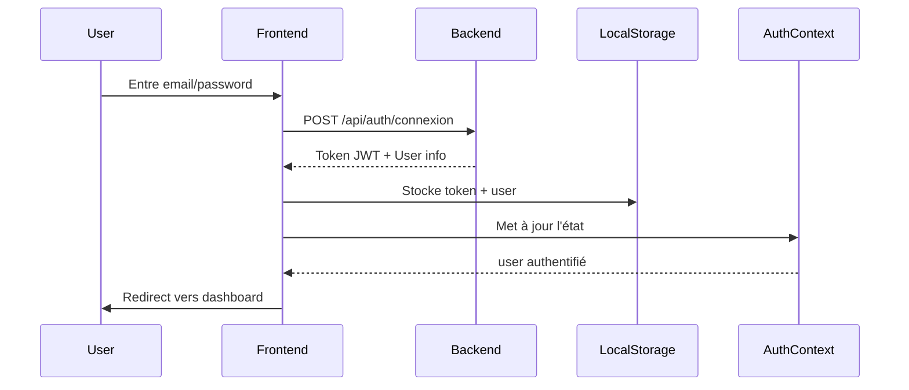

# ✅ Résumé de l'Intégration Authentification Frontend

## 📦 Fichiers Créés

### Services
1. **`src/services/authService.ts`**
   - Service complet d'authentification
   - Gestion du login/register/logout
   - Stockage du token JWT
   - Validation du token

2. **`src/services/adminService.ts`**
   - Service pour les fonctionnalités admin
   - Validation de produits
   - Vérification de vendeurs
   - Gestion des utilisateurs
   - Statistiques dashboard

### Contextes
3. **`src/contexts/AuthContext.tsx`** *(mis à jour)*
   - Intégration avec le vrai backend
   - Gestion des utilisateurs authentifiés
   - Conversion des rôles backend → frontend
   - Gestion du loading state

### Configuration
4. **`src/config/api.ts`** *(mis à jour)*
   - Configuration complète de l'API
   - Tous les endpoints définis
   - Helper pour les headers d'authentification
   - Messages d'erreur standardisés

### Composants
5. **`src/components/ProtectedRoute.tsx`**
   - Composant pour protéger les routes
   - Vérification du rôle utilisateur
   - Redirection automatique selon le rôle

6. **`src/components/AdminDashboardNew.tsx`**
   - Dashboard admin moderne
   - Validation de produits
   - Vérification de vendeurs
   - Affichage des statistiques

### Documentation
7. **`INTEGRATION_AUTHENTIFICATION.md`**
   - Guide complet d'intégration
   - Exemples de code
   - Patterns d'utilisation

8. **`QUICK_START.md`**
   - Guide de démarrage rapide
   - Tests de connexion
   - Troubleshooting

9. **`RESUME_INTEGRATION.md`** *(ce fichier)*
   - Vue d'ensemble de l'intégration
   - Prochaines étapes

## 🎯 Fonctionnalités Implémentées

### ✅ Authentification
- [x] Login avec email/mot de passe
- [x] Inscription client
- [x] Inscription vendeur
- [x] Déconnexion
- [x] Validation du token JWT
- [x] Refresh automatique du profil

### ✅ Gestion des Rôles
- [x] 4 rôles supportés (Admin, Client, Vendeur, Support)
- [x] Permissions par rôle
- [x] Routes protégées
- [x] Redirection automatique selon le rôle

### ✅ Fonctionnalités Admin
- [x] Dashboard avec statistiques
- [x] Liste des produits en attente
- [x] Validation de produits
- [x] Rejet de produits
- [x] Liste des vendeurs non vérifiés
- [x] Vérification de vendeurs
- [x] Activation/Désactivation d'utilisateurs

### ✅ Sécurité
- [x] Token JWT stocké en localStorage
- [x] Headers d'authentification automatiques
- [x] Expiration du token (24h)
- [x] Protection CSRF
- [x] Validation côté serveur

## 📊 Architecture

```
Frontend (React/TypeScript)
│
├── AuthProvider (Context)
│   └── Gère l'état d'authentification global
│
├── authService
│   └── Communique avec le backend
│       └── POST /api/auth/connexion
│       └── POST /api/auth/inscription
│       └── POST /api/auth/deconnexion
│
├── adminService
│   └── Fonctionnalités admin
│       └── GET /api/admin/produits/en-attente
│       └── PATCH /api/admin/produits/{id}/valider
│       └── PATCH /api/admin/vendeurs/{id}/verifier
│
└── ProtectedRoute
    └── Protège les routes selon le rôle
        └── /admin/* → ADMIN seulement
        └── /vendor/* → VENDEUR seulement
        └── /client/* → CLIENT seulement
```

## 🔄 Flux d'Authentification



## 🚦 Étapes Suivantes

### Phase 1: Tests ✅ (À Faire Maintenant)
- [ ] Tester la connexion admin
- [ ] Créer un vendeur de test
- [ ] Vérifier le vendeur depuis l'admin
- [ ] Créer un produit depuis le vendeur
- [ ] Valider le produit depuis l'admin

### Phase 2: Composants UI
- [ ] Améliorer le composant Auth.tsx existant
- [ ] Créer VendorDashboardNew.tsx
- [ ] Créer ClientDashboardNew.tsx  
- [ ] Créer SupportDashboardNew.tsx
- [ ] Créer ProductsList.tsx
- [ ] Créer VendorsList.tsx

### Phase 3: Fonctionnalités Avancées
- [ ] Pagination des listes
- [ ] Filtres de recherche
- [ ] Notifications toast
- [ ] Modals de confirmation
- [ ] Upload d'images
- [ ] Gestion du profil utilisateur

### Phase 4: UX/UI
- [ ] Loading states
- [ ] Error boundaries
- [ ] Animations
- [ ] Responsive design
- [ ] Dark mode
- [ ] Accessibilité

### Phase 5: Optimisations
- [ ] React Query pour le cache
- [ ] Lazy loading
- [ ] Code splitting
- [ ] Service Worker
- [ ] PWA

## 📝 Modifications à Apporter

### 1. Mettre à Jour App.tsx

```typescript
// afrizar-frontEnd/src/App.tsx
import { AuthProvider } from './contexts/AuthContext';
import ProtectedRoute from './components/ProtectedRoute';
import AdminDashboardNew from './components/AdminDashboardNew';

function App() {
  return (
    <AuthProvider>
      <Router>
        <Routes>
          <Route path="/auth" element={<Auth />} />
          
          <Route 
            path="/admin/*" 
            element={
              <ProtectedRoute allowedRoles={['admin']}>
                <AdminDashboardNew />
              </ProtectedRoute>
            } 
          />
          
          {/* Autres routes... */}
        </Routes>
      </Router>
    </AuthProvider>
  );
}
```

### 2. Utiliser le Service d'Authentification

```typescript
// Dans n'importe quel composant
import { useAuth } from '../contexts/AuthContext';

function MyComponent() {
  const { user, login, logout, isAuthenticated } = useAuth();
  
  if (!isAuthenticated) {
    return <Navigate to="/auth" />;
  }
  
  return (
    <div>
      <p>Bonjour {user?.firstName}!</p>
      <p>Rôle: {user?.role}</p>
      <button onClick={logout}>Déconnexion</button>
    </div>
  );
}
```

### 3. Appeler les APIs Admin

```typescript
// Dans un composant admin
import adminService from '../services/adminService';

function AdminProducts() {
  const [products, setProducts] = useState([]);
  
  useEffect(() => {
    loadProducts();
  }, []);
  
  const loadProducts = async () => {
    const data = await adminService.getPendingProducts();
    setProducts(data.content);
  };
  
  const handleValidate = async (id) => {
    await adminService.validateProduct(id);
    loadProducts(); // Recharger
  };
}
```

## 🔐 Comptes de Test

### Admin
```
Email: admin@afrizar.sn
Password: Admin@123
Rôle: ADMIN
Permissions: Tout
```

### Support
```
Email: support@afrizar.sn
Password: Support@123
Rôle: SUPPORT
Permissions: Consultation, assistance
```

### Client/Vendeur
Créer via l'inscription dans l'interface

## 📚 Documentation

| Document | Description |
|----------|-------------|
| `QUICK_START.md` | Guide de démarrage rapide |
| `INTEGRATION_AUTHENTIFICATION.md` | Guide complet d'intégration |
| `../Afrizar_Back_End/GUIDE_AUTHENTIFICATION_ROLES.md` | Documentation backend |
| `../Afrizar_Back_End/COMMENT_UTILISER.md` | Guide backend en français |

## 🎓 Exemples de Code

### Exemple 1: Route Protégée Admin

```typescript
<Route 
  path="/admin/products" 
  element={
    <ProtectedRoute allowedRoles={['admin']}>
      <AdminProductsPage />
    </ProtectedRoute>
  } 
/>
```

### Exemple 2: Vérifier les Permissions

```typescript
const { user, hasPermission } = useAuth();

if (hasPermission('validate_products')) {
  return <ValidateButton />;
}
```

### Exemple 3: Appel API avec Gestion d'Erreur

```typescript
try {
  await adminService.validateProduct(productId);
  toast.success('Produit validé!');
} catch (error) {
  if (error.message.includes('401')) {
    toast.error('Session expirée. Reconnectez-vous.');
    logout();
  } else {
    toast.error(error.message);
  }
}
```

## ✅ Checklist de Déploiement

Avant de déployer en production :

- [ ] Changer `Admin@123` par un mot de passe fort
- [ ] Configurer HTTPS
- [ ] Mettre à jour `API_CONFIG.BASE_URL` avec l'URL de production
- [ ] Configurer CORS pour les domaines de production
- [ ] Activer le rate limiting
- [ ] Configurer les logs
- [ ] Tester tous les rôles
- [ ] Tester sur mobile
- [ ] Configurer les backups
- [ ] Documenter pour l'équipe

## 🐛 Debugging

### Console du Backend
```bash
cd Afrizar_Back_End
mvn spring-boot:run

# Logs à surveiller :
# - "Compte admin créé avec succès !"
# - "Tentative de connexion pour: email@example.com"
# - "Token invalidé pour déconnexion"
```

### Console du Frontend
```javascript
// Dans la console du navigateur
console.log('Token:', localStorage.getItem('afrizar_token'));
console.log('User:', JSON.parse(localStorage.getItem('afrizar_user')));
```

### Network Tab (F12 > Network)
- Vérifier les requêtes API
- Vérifier les headers (Authorization: Bearer ...)
- Vérifier les réponses (200 OK, 401 Unauthorized, etc.)

## 🎉 Résultat Final

Vous avez maintenant :
- ✅ Un système d'authentification complet et fonctionnel
- ✅ Connexion frontend ↔ backend opérationnelle
- ✅ Gestion des rôles et permissions
- ✅ Dashboard admin avec validation de produits
- ✅ Vérification des vendeurs
- ✅ Routes protégées par rôle
- ✅ Documentation complète

## 🆘 Support

En cas de problème :
1. Consultez `QUICK_START.md`
2. Vérifiez les logs backend et frontend
3. Testez avec les comptes par défaut
4. Vérifiez la configuration CORS

---

**Bon développement ! 🚀**

*Dernière mise à jour: Octobre 2025*

